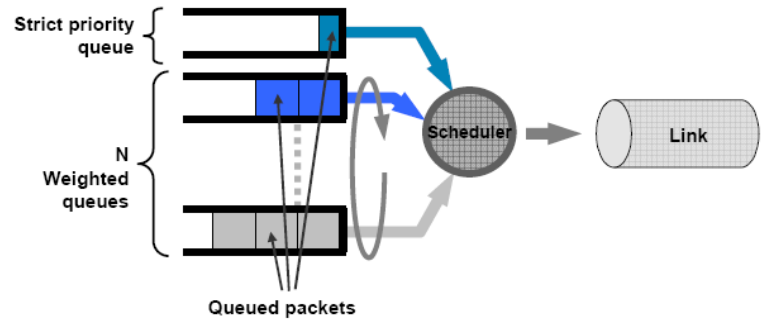

# Class-based Weighted Fair Queuing

CBWFQ (Class-based Weighted Fair Queuing) is a highly customizable version of WFQ. A classic CBWFQ customization is to use SP (Strict Priority) + WFQ, which is also referred to as LLQ (Low-Latency Queuing).

## Overview

CBWFQ is essentially the same as WFQ, except that several parameters are customizable. Each QoS level is also referred to here as a class, which is why the algorithm is called "Class-based".

- According to [Cisco](https://www.cisco.com/c/en/us/td/docs/ios-xml/ios/qos_conmgt/configuration/xe-3s/qos-conmgt-xe-3s-book/qos-conmgt-oview.html#GUID-48F6AF58-5CCC-44A0-B868-125AE453FF2A): 
  - Traffic classes can be defined based on "match criteria including protocols, access control lists (ACLs), and input interfaces". Queue weights can also be customized. This refers to defining the QoS queues $Q$ and the classifier $C$ in the pseudocode of [WFQ](weighted-fair-queuing.md#pseudocode).
  - WRED (Weighted Random Early Detection) packet dropping policy can be configured rather than tail drop in WFQ. Queue buffer sizes can also be customized.
  - Hybrid algorithms can be configured, such as LLQ as SP + WFQ.
- LLQ is a classic feature of CBWFQ which combines SP and WFQ together. In this setting, SP and WFQ will be assigned maximum available bandwidth values that they can use. Then, the transmission order follows the description below:
  - All packets from SP classes will be transmitted first through the output link, using the assgined bandwidth for SP. Only after SP finishes can WFQ transmitted the remaining packets using the assigned bandwidth for WFQ.
  - If there are multiple SP classes, all packets in these classes are pushed to the same single, strict priority queue, according to [Wikipedia](https://en.wikipedia.org/wiki/Low-latency_queuing) and [H3C](https://www.h3c.com/en/d_202102/1383679_294551_0.htm).



For a more detailed CBWFQ structure, refer to the documentation of [H3C](https://www.h3c.com/en/d_202102/1383679_294551_0.htm).

### Reference

- Cisco:
  - Explanation:
    - https://www.cisco.com/c/en/us/td/docs/ios-xml/ios/qos_conmgt/configuration/xe-3s/qos-conmgt-xe-3s-book/qos-conmgt-oview.html#GUID-48F6AF58-5CCC-44A0-B868-125AE453FF2A
    - https://www.cisco.com/en/US/docs/ios/12_0t/12_0t5/feature/guide/cbwfq.html#wp17641
  - Configuration:
    - https://www.cisco.com/c/en/us/td/docs/ios-xml/ios/qos_conmgt/configuration/15-mt/qos-conmgt-15-mt-book/qos-conmgt-cfg-wfq.html#GUID-59B9DF87-C8B5-4791-AB67-79244F683310
    - Example: https://www.cisco.com/c/en/us/td/docs/ios-xml/ios/qos_conmgt/configuration/15-mt/qos-conmgt-15-mt-book/qos-conmgt-cfg-wfq.html#GUID-86DC108D-4CE0-498F-AB8C-4229F6799589
- H3C: https://www.h3c.com/en/d_202102/1383679_294551_0.htm
- Wikipedia: https://en.wikipedia.org/wiki/Low-latency_queuing

## Pseudocode

The pseudocode of CBWFQ is rather similar to [WFQ](weighted-fair-queuing.md#pseudocode). Below provides a slightly modified version for LLQ using a customized packet dropping handler $D$ (e.g., tail drop, WRED).

```pseudocode
Parameters:
  1. List of packets X = [x0, x1, ...].
  2. One single QoS queue p for SP.
  2. Set of QoS queues Q = {q0, q1, ...} for WFQ, where q = {assigned bandwidth r}.
  3. Classifier C: x -> p or q, to map packets to QoS queues.
  4. Packet dropping handler D: x -> T/F to decide whether to drop a packet.
  5. Output packet x* for transmission.

def llq_enqueue(Q, C, x):
  t = C(x)
  if D(x) is false:
    t.push(x)
    if t in Q:
      // the mapped queue is a WFQ queue
      wfq_update_time(x, q)

def llq_dequeue(Q) -> x*:
  // handle SP queue first
  x* = sp_dequeue({p})
  if x* != null:
    return x*
  // handle WFQ queues
  x* = wfq_dequeue(Q)
  return x*
```