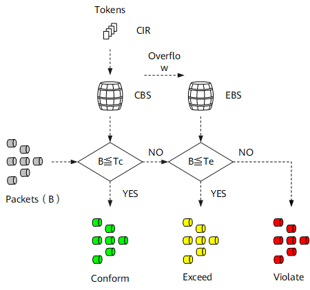
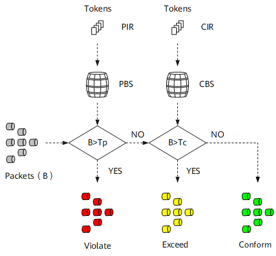

# Token Bucket

## Overview

Token buckets can be used for traffic shaping and policing.
Two common algorithms defined by RFC are: 
* srTCM: single rate three color marker
* trTCM: two rate three color marker

Two modes:
* Color-Blind mode: assuming incoming packets are color-less
* Color-Aware mode: assuming incoming packets have been marked with colors by previous network elements

References:
https://www.rfc-archive.org/getrfc.php?rfc=2697#gsc.tab=0
https://datatracker.ietf.org/doc/html/rfc2698
https://support.huawei.com/enterprise/zh/doc/EDOC1100112412/4e5900ad

## srTCM: single rate Three Color Marker

Parameters: 
* CIR (commited inforation rate): the rate at which tokens are put into bucket C, that is, the average traffic rate that bucket C allows.
* CBS(commited burst size): the capacity of bucket C, that is, the maximum volume of burst traffic that bucket C allows.
* EBS (excess burst size): the capacity of bucket E, that is, the maximum volume of excess burst traffic that bucket E allows.

### Pseudocode

```python
parameters:
	CIR  # commited inforation rate: token generation rate
    CBS  # commited burst size: capacity of bucket C
    EBS  # excess burst size: capacity of bucket E; can be 0
	is_color_aware  # 1 for color-aware mode, 0 for color-blind mode
    
state variables:
	T_c = CBS  # number of tokens in bucket C, initialised to CBS
	T_e = EBS  # number of tokens in bucket E, initialised to EBS
	current_time = 0   # the current simulation time, initialised to 0

input: 
	packet  # the incoming packet, with three properties: timestamp, size, color

# The event handler for a packet arrival event
# Modify the packet color and other variables defined above
def srTCM(packet):
	new_time = packet.timestamp
    num_new_tokens = CIR * (new_time - current_time)
    current_time = new_time
	
    # Add tokens to the bucket(s)
    # First add to C bucket
    T_c += num_new_tokens
    if(T_c > CBS):
    	_delta = T_c - CBS
    	T_c = CBS
        # Then add excess tokens to E bucket
        T_e += _delta
        if(T_e > EBS):
        	T_e = EBS
    
    # Mark/color the packet (T_e can be 0)
    if(is_color_aware == 0):  # color-blind mode
        if(packet.size <= T_c):
        	packet.color = "green"
            T_c -= packet.size
        elif(packet.size <= T_e):
        	packet.color = "yellow"
        else: 
        	packet.color = "red"  # only mark the packet, do not decrease tokens
	else:  # color-aware mode
    	if(packet.color == "green" and packet.size <= T_c):
        	# the packet is still green
            T_c -= packet.size
        elif((packet.color == "green" or packet.color == "yellow") and packet.size <= T_e):
        	packet.color = "yellow"
            T_e -= packet.size
        else:
        	packet.color = "red"  # only mark the packet, do not decrease tokens
    
    
```

## trTCM: two rate Three Color Marker

Parameters: 
* PIR (Peak information rate): the rate at which tokens are put into bucket P, that is, the maximum traffic rate that bucket P allows. **The PIR is greater than the CIR**.
* CIR (commited inforation rate): the rate at which tokens are put into bucket C, that is, the average traffic rate that bucket C allows.
* PBS (Peak Burst Size): the capacity of bucket P, that is, the maximum volume of burst traffic that bucket P allows.
* CBS(commited burst size): the capacity of bucket C, that is, the maximum volume of burst traffic that bucket C allows.

### Pseudocode

```python
parameters:
	PIR  # peak information rate: token generation rate for bucket P; PIR > CIR
    CIR  # commited inforation rate: token generation rate for bucket C; PIR > CIR
    PBS  # peak burst size: capacity of bucket P
    CBS  # commited burst size: capacity of bucket C
	is_color_aware  # 1 for color-aware mode, 0 for color-blind mode
	# PIR must be greater than CIR!
    
state variables:
	T_c = CBS  # number of tokens in bucket C, initialised to CBS
	T_p = PBS  # number of tokens in bucket P, initialised to PBS
	current_time = 0   # the current simulation time, initialised to 0

input: 
	packet  # the incoming packet, with three properties: timestamp, size, color

# The event handler for a packet arrival event
# Modify the packet color and other variables defined above
def trTCM(packet):
	new_time = packet.timestamp

	# Add tokens to the two buckets
    T_p += PIR * (new_time - current_time)
	T_p = min(T_p, PBS)
    T_c += CIR * (new_time - current_time)
    T_c = min(T_c, CBS)
    
    current_time = new_time 

    # Mark/color the packet
    if(is_color_aware == 0):  # color-blind mode
    	if(packet.size > T_p):
        	packet.color = "red"  # only mark the packet, do not decrease tokens
        elif(packet.size > T_c):
        	packet.color = "yellow"
            T_p -= packet.size
        else:
        	packet.color = "green"
            T_c -= packet.size
            T_p -= packet.szie
	else:  # color-aware mode
    	if(packet.color == "red" or packet.size > T_p):
        	packet.color = "red"
        elif(packet.color == "yellow" or packet.size > T_c):
        	packet.color = "yellow"
            T_p -= packet.size
        else:
        	packet.color = "green"
			T_c -= packet.size
            T_p -= packet.size

```
