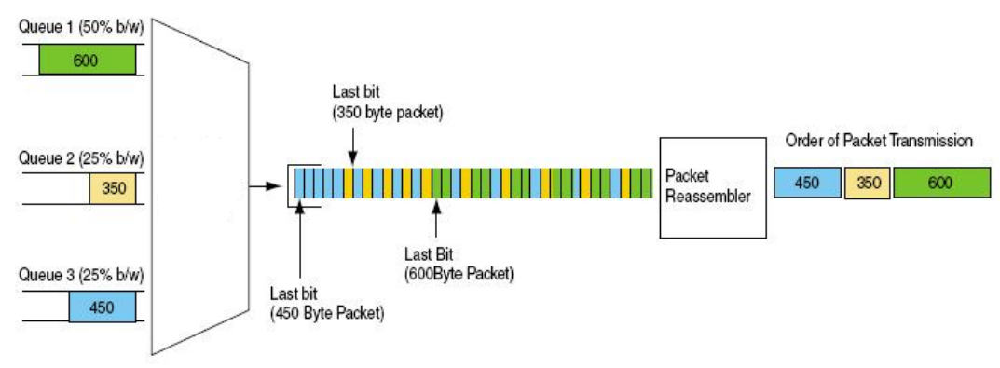

# Weighted Fair Queuing

WFQ (Weighted Fair Queuing) schedules data bits from packets in a weighted RR (Round-Robin) manner.

## Overview

Essentially, weights are assigned to the QoS queues to indicate the access frequency of these queues. Logically, packets are divided into bits and scheduled according to queue weights. Packet bits from more prioritized queues (with higher weights) are more frequently accessed. When the last bit of a packet is accessed, this packet becomes ready for transmission.

- According to [Cisco](https://www.cisco.com/c/en/us/td/docs/ios-xml/ios/qos_conmgt/configuration/xe-3s/qos-conmgt-xe-3s-book/qos-conmgt-oview.html#GUID-1C561DDB-2BFE-46E2-872C-386CC19D601A), weights are determined by: 
  - required QoS (IP Predcedence, RSVP in IntServ), and;
  - flow throughput inversely proportional.
- Packets in the same QoS queue are scanned in FIFO manner.



The figure above sources from this paper: [Apportioning Bandwidth to Clients as per Privileges](https://article.nadiapub.com/IJFGCN/vol1_no1/15.pdf).

Interestingly, in the actual implementation, packets are not divided into bits, and there is no packet reassembling from bits. Alternatively, virtual departure/finishing time of the packet is estimated according to the queue weights as well as the output link rate. Then, the packet with the smallest virtual finishing time is selected in each transmission.

Suppose the output link rate is $R$ and each QoS queue $q \in Q$ is assigned a weight value $w$. Then, the expected data rate $R_i$ of each queue $q_i$ is calculated as follow:

$$
R_i = \frac{w_i}{\sum_i w_i} R.
$$

Now there is a new packet $x \in X$ entering a specific queue $q_k$. We would like to calculate the virtual finishing time of this packet $x.f$. To do this, we need to figure out its virtual starting time $x.s$ in advance:
1. When $q_k$ is empty, we can transmit this packet right away and $x.s$ is the current time.
2. Otherwise, when $q_k$ is not empty, we can only transmit this packet after the last one in $q_k$ has finished its transmission. For easier identification, we record the virtual finishing time of the last packet as a parameter $f_k$ of queue $q_k$. Then, $x.s = f_k$.

Then, given the packet size $x.l$, we can calculate the virtual finishing time of this packet as follow:

$$
x.f = x.s + \frac{x.l}{R_i}.
$$

Finally, the packet with the smallest $x.f$ is selected for each transmission. Since the time order has been maintained in each QoS queue (FIFO with virtual finishing time recorded), we only need to look at the packets at the head of each queue and select the one with the smallest $x.f$. In this way, we reduce the computation complexity.

### Reference

- Cisco: https://www.cisco.com/c/en/us/td/docs/ios-xml/ios/qos_conmgt/configuration/xe-3s/qos-conmgt-xe-3s-book/qos-conmgt-oview.html#GUID-1C561DDB-2BFE-46E2-872C-386CC19D601A
- http://what-when-how.com/qos-enabled-networks/queuing-and-scheduling-qos-enabled-networks-part-2/
- Paper: Apportioning Bandwidth to Clients as per Privileges - https://article.nadiapub.com/IJFGCN/vol1_no1/15.pdf
- Wikipedia: 
  - FQ: https://en.wikipedia.org/wiki/Fair_queuing#Pseudocode
  - WFQ: https://en.wikipedia.org/wiki/Weighted_fair_queueing

## Pseudocode

```pseudocode
Parameters:
  1. List of packets X = [x0, x1, ...], where x = {virtual starting time s, virtual finishing time f, packet size l}.
  2. Set of QoS queues Q = {q0, q1, ...}, where q = {weight w, buffer size s, virtual finishing time f, expected data rate r}.
  3. Classifier C: x -> q to map packets to QoS queues.
  4. Output link rate R.
  5. Output packet x* for transmission.

def wfq_enqueue(Q, C, R, x):
  q = C(x)
  if q.s is enough to hold x:
    q.push(x)
    // calcuate expected data rates and update time values
    q.r = q.w / sum({q'.w for q' in Q}) * R
    wfq_update_time(x, q)

def wfq_update_time(x, q):
  x.s = max(time.now(), q.f)
  x.f = x.s + x.l / q.r
  q.f = x.f

def wfq_dequeue(Q) -> x*:
  if every q in Q is empty:
    // no packet to transmit
    return null
  // find the packet with the smallest virtual finishing time
  // x = q.poll() picks the packet at the head of the queue
  q* = argmin{q.poll().f for q in Q if q is not empty}
  x* = q*.pop()
  return x*
```